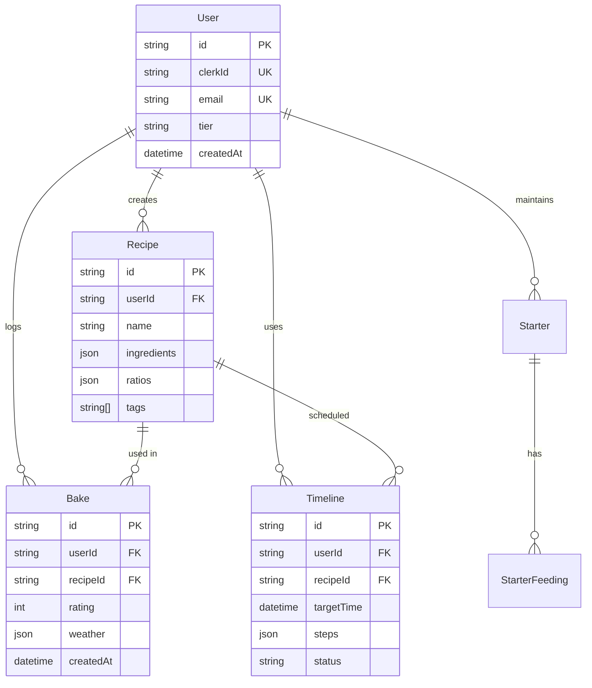

# Architecture Documentation

## System Overview

Baker's Suite is a full-stack web application built as a TypeScript monorepo. It provides intelligent baking assistance through recipe management, weather-aware scheduling, and flavor discovery.

## High-Level Architecture

```
┌─────────────────────────────────────────────────────────────┐
│                        Clients                               │
│  ┌──────────────┐  ┌──────────────┐  ┌──────────────┐      │
│  │   Web App    │  │  Mobile App  │  │     API      │      │
│  │  (Next.js)   │  │ (Future)     │  │   Clients    │      │
│  └──────────────┘  └──────────────┘  └──────────────┘      │
└─────────────────────────────────────────────────────────────┘
                            │
                            ▼
┌─────────────────────────────────────────────────────────────┐
│                    Load Balancer                             │
│                      (Vercel)                                │
└─────────────────────────────────────────────────────────────┘
                            │
          ┌─────────────────┴─────────────────┐
          ▼                                   ▼
┌──────────────────────┐          ┌──────────────────────┐
│   Frontend Server    │          │   API Server         │
│   (Next.js SSR)      │          │   (Express.js)       │
│   - Server Actions   │          │   - REST API         │
│   - API Routes       │◄────────►│   - Business Logic   │
└──────────────────────┘          └──────────────────────┘
          │                                   │
          │                                   │
          ▼                                   ▼
┌─────────────────────────────────────────────────────────────┐
│                    Services Layer                            │
│  ┌──────────┐ ┌──────────┐ ┌──────────┐ ┌──────────┐      │
│  │   Auth   │ │  Weather │ │ Storage  │ │Analytics │      │
│  │ (Clerk)  │ │   (OWM)  │ │   (R2)   │ │(PostHog) │      │
│  └──────────┘ └──────────┘ └──────────┘ └──────────┘      │
└─────────────────────────────────────────────────────────────┘
                            │
          ┌─────────────────┴─────────────────┐
          ▼                                   ▼
┌──────────────────────┐          ┌──────────────────────┐
│    PostgreSQL        │          │      Redis           │
│  (Primary DB)        │          │    (Cache)           │
│  - Recipes           │          │  - Session Data      │
│  - Users             │          │  - Weather Cache     │
│  - Bakes             │          │  - Rate Limiting     │
└──────────────────────┘          └──────────────────────┘
```

## Technology Stack

### Frontend

**Framework:** Next.js 14 with App Router
- **Why:** Server Components, built-in optimization, excellent DX
- **Trade-offs:** Learning curve for App Router, some features still experimental

**UI Library:** Shadcn/ui + Radix UI
- **Why:** Accessible, customizable, no runtime overhead
- **Trade-offs:** More setup than pre-built libraries

**State Management:**
- **Zustand:** Client-side UI state
- **TanStack Query:** Server state, caching, optimistic updates
- **Why:** Lightweight, performant, great TypeScript support

### Backend

**Framework:** Express.js
- **Why:** Mature, flexible, extensive ecosystem
- **Trade-offs:** More boilerplate than newer frameworks

**ORM:** Prisma
- **Why:** Type-safe, great DX, excellent migrations
- **Trade-offs:** Limited support for advanced SQL features

**Database:** PostgreSQL
- **Why:** Robust, ACID compliant, JSON support, mature
- **Trade-offs:** Vertical scaling limitations

**Cache:** Redis
- **Why:** Fast, versatile, persistent option available
- **Trade-offs:** Additional infrastructure

## Data Flow

### Recipe Creation Flow

```
┌──────────┐
│   User   │
└────┬─────┘
     │ 1. Submit form
     ▼
┌──────────────────┐
│  React Component │
│  (RecipeForm)    │
└────┬─────────────┘
     │ 2. Validate with Zod
     ▼
┌──────────────────┐
│  React Query     │
│  Mutation        │
└────┬─────────────┘
     │ 3. POST /api/v1/recipes
     ▼
┌──────────────────┐
│  API Middleware  │
│  - Auth Check    │
│  - Rate Limit    │
└────┬─────────────┘
     │ 4. Authorized
     ▼
┌──────────────────┐
│  Controller      │
│  (Validation)    │
└────┬─────────────┘
     │ 5. Valid data
     ▼
┌──────────────────┐
│  Service         │
│  - Calculate %   │
│  - Business Logic│
└────┬─────────────┘
     │ 6. Save to DB
     ▼
┌──────────────────┐
│  Prisma          │
│  (ORM)           │
└────┬─────────────┘
     │ 7. SQL INSERT
     ▼
┌──────────────────┐
│  PostgreSQL      │
└────┬─────────────┘
     │ 8. Return recipe
     ▼
┌──────────────────┐
│  Response        │
│  (JSON)          │
└──────────────────┘
```

### Weather-Aware Timeline Generation

```
┌──────────┐
│   User   │ Requests timeline for recipe
└────┬─────┘
     │
     ▼
┌──────────────────┐
│  Timeline API    │
└────┬─────────────┘
     │ 1. Get recipe details
     ▼
┌──────────────────┐
│  Recipe DB       │
└────┬─────────────┘
     │ 2. Check weather cache
     ▼
┌──────────────────┐
│  Redis Cache     │──────No──────┐
└────┬─────────────┘              │
     │ Yes                        │
     │ 3. Cached data             │ 4. Fetch fresh
     ▼                            ▼
┌──────────────────┐    ┌──────────────────┐
│  Weather Service │    │  OpenWeatherMap  │
└────┬─────────────┘    └────┬─────────────┘
     │ 5. Cache result       │
     │◄──────────────────────┘
     │ 6. Calculate timeline
     ▼
┌──────────────────┐
│  Timeline Calc   │
│  - Base times    │
│  - Temp adjust   │
│  - Humidity adj  │
└────┬─────────────┘
     │ 7. Save timeline
     ▼
┌──────────────────┐
│  Timeline DB     │
└────┬─────────────┘
     │ 8. Return to user
     ▼
┌──────────────────┐
│  User gets       │
│  optimized plan  │
└──────────────────┘
```

## Database Schema

### Core Entities



### Indexes

Critical indexes for performance:

```sql
-- User lookups
CREATE INDEX idx_user_clerk_id ON User(clerkId);
CREATE INDEX idx_user_email ON User(email);

-- Recipe queries
CREATE INDEX idx_recipe_user_id ON Recipe(userId);
CREATE INDEX idx_recipe_created_at ON Recipe(createdAt);

-- Bake logs
CREATE INDEX idx_bake_user_id ON Bake(userId);
CREATE INDEX idx_bake_recipe_id ON Bake(recipeId);
CREATE INDEX idx_bake_created_at ON Bake(createdAt);

-- Timeline queries
CREATE INDEX idx_timeline_status ON Timeline(status);
CREATE INDEX idx_timeline_target_time ON Timeline(targetTime);
```

## API Design

### RESTful Conventions

- `GET /resources` - List resources
- `GET /resources/:id` - Get single resource
- `POST /resources` - Create resource
- `PUT /resources/:id` - Update resource
- `PATCH /resources/:id` - Partial update
- `DELETE /resources/:id` - Delete resource

### Response Structure

All responses follow consistent format:

```typescript
interface ApiResponse<T> {
  data?: T;
  error?: {
    code: string;
    message: string;
    details?: unknown;
  };
  meta?: {
    page?: number;
    limit?: number;
    total?: number;
  };
}
```

### Error Handling

Errors bubble up through layers:

```
Controller → Service → Database
    ↓          ↓          ↓
Error Middleware ← ← ← ← ←
    ↓
Log Error
    ↓
Format Response
    ↓
Send to Client
```

## Security

### Authentication & Authorization

**Authentication:** Clerk handles all auth
- JWT tokens in Authorization header
- Session validation on every request
- Automatic token refresh

**Authorization:** Role-based access control
- User can only access their own data
- Premium features check user tier
- API endpoints validate ownership

### Data Protection

- All passwords hashed (handled by Clerk)
- Sensitive data encrypted at rest (PostgreSQL)
- TLS/SSL in transit (HTTPS)
- SQL injection prevented (Prisma)
- XSS prevented (React escaping)
- CSRF tokens on mutations

### Rate Limiting

```typescript
// Per IP: 100 requests / 15 minutes
// Per User: 1000 requests / hour

const limiter = rateLimit({
  windowMs: 15 * 60 * 1000,
  max: 100,
  standardHeaders: true,
  legacyHeaders: false,
});
```

## Caching Strategy

### Redis Cache

**Weather Data:**
- Key: `weather:${lat}:${lon}`
- TTL: 30 minutes
- Invalidation: Time-based

**User Sessions:**
- Key: `session:${userId}`
- TTL: 24 hours
- Invalidation: On logout

**Rate Limiting:**
- Key: `ratelimit:${ip}` or `ratelimit:user:${userId}`
- TTL: Window duration
- Invalidation: Time-based

### Frontend Cache

**React Query:**
- Stale time: 5 minutes
- Cache time: 30 minutes
- Refetch on window focus: true
- Automatic garbage collection

**Next.js:**
- Static pages: Cached at CDN
- Dynamic pages: Server-side rendered
- API routes: No caching (fresh data)

## Performance Optimizations

### Frontend

1. **Code Splitting:**
   - Route-based splitting (automatic in Next.js)
   - Component lazy loading for heavy features
   - Dynamic imports for modals/dialogs

2. **Image Optimization:**
   - Next.js Image component
   - WebP format with fallbacks
   - Responsive images
   - Lazy loading below fold

3. **Rendering Strategy:**
   - Server Components for static content
   - Client Components for interactivity
   - Streaming SSR for faster TTFB

### Backend

1. **Database:**
   - Connection pooling (Prisma)
   - Query optimization (select specific fields)
   - Indexes on foreign keys
   - Batch operations where possible

2. **API:**
   - Compression (gzip)
   - Response caching (Redis)
   - Pagination for lists
   - Field selection (sparse fieldsets)

3. **Background Jobs:**
   - Weather data pre-fetching
   - Cleanup old sessions
   - Generate reports

## Monitoring & Observability

### Error Tracking

**Sentry:**
- Frontend errors
- Backend errors
- Performance monitoring
- Release tracking

### Analytics

**PostHog:**
- User behavior
- Feature usage
- Conversion funnels
- A/B testing

### Logging

**Winston (Backend):**
```typescript
logger.info('User logged in', { userId });
logger.error('Database error', { error, query });
```

**Console (Frontend):**
- Errors automatically sent to Sentry
- Debug logs in development only

## Deployment

### Frontend (Vercel)

```yaml
Build Command: npm run build
Output Directory: apps/web/.next
Environment Variables:
  - NEXT_PUBLIC_CLERK_PUBLISHABLE_KEY
  - NEXT_PUBLIC_API_URL
  - DATABASE_URL (for build-time queries)
```

### Backend (Railway)

```yaml
Build Command: npm run build
Start Command: npm run start
Environment Variables:
  - All from .env.example
Port: 3001
```

### Database (Neon)

- Managed PostgreSQL
- Automatic backups
- Branching for preview deployments
- Connection pooling

### CI/CD Pipeline

```yaml
1. Push to GitHub
2. Run tests (GitHub Actions)
3. Build applications
4. Deploy to preview (PR)
5. Deploy to production (merge to main)
```

## Scalability Considerations

### Current Limitations

- Single backend instance
- Vertical scaling only
- No CDN for API
- Session storage in Redis (single point of failure)

### Future Improvements

1. **Horizontal Scaling:**
   - Multiple API instances behind load balancer
   - Stateless sessions
   - Distributed cache (Redis Cluster)

2. **Database:**
   - Read replicas for queries
   - Write to primary
   - Connection pooling

3. **CDN:**
   - CloudFlare in front of API
   - Cache static responses
   - DDoS protection

4. **Microservices:**
   - Extract weather service
   - Extract calculation engine
   - Message queue for async tasks

## Development Workflow

```
1. Local Development
   └─> npm run dev (all services)

2. Git Workflow
   └─> Feature branch → PR → Review → Merge

3. CI/CD
   └─> Tests → Build → Deploy Preview

4. Production
   └─> Merge to main → Deploy → Monitor
```

## Trade-offs & Decisions

### Monorepo vs Polyrepo
**Choice:** Monorepo (Turborepo)
**Why:** Code sharing, consistent versioning, easier refactoring
**Trade-off:** Larger codebase, requires good structure

### ORM vs Raw SQL
**Choice:** Prisma ORM
**Why:** Type safety, migrations, great DX
**Trade-off:** Performance overhead, limited raw SQL support

### Server vs Client Components
**Choice:** Server Components by default
**Why:** Faster initial load, less client JS
**Trade-off:** Learning curve, interactivity limits

### Polling vs WebSockets
**Choice:** Polling (React Query)
**Why:** Simpler, works everywhere, good enough
**Trade-off:** Not real-time, more requests

---

For implementation details, see [CLAUDE.md](../CLAUDE.md).

For API reference, see [API.md](./API.md).
